# pi-cicd


A self-hosted CI/CD and continuous-backup system for the Raspberry Pi
that runs my marine radio kiosk and home services. Every project on the
machine — whether I create it deliberately or a new directory appears —
is automatically versioned, CI-tested on GitHub, deployed to live
systemd services with health-checks and rollback, and continuously
backed up, committed work and work-in-progress alike.

This repo is the machinery itself: it runs in production on the Pi and
deploys the services listed at the bottom.

## The whole system

```mermaid
flowchart TB
    subgraph DEV[Any machine, or the Pi itself]
        CODE[edit code]
        COMMIT[git commit]
    end
    subgraph GH[GitHub]
        REPO[(repos - public for show,\nprivate by default on adoption)]
        CI[Actions CI\nruff + compileall + pytest\nPython 3.11 & 3.13]
    end
    subgraph PI[The Pi - dunbot]
        GUARD[project-guard\nevery 10 min]
        DEPLOY[deploy.sh per service\nevery 3 min]
        SVC[systemd services\n:8000 :8090 :8085]
    end

    CODE --> COMMIT -->|git push| REPO --> CI
    GUARD -->|adopt new projects,\npush current branch,\nsnapshot dirty trees| REPO
    GUARD -->|discovers| CODE
    DEPLOY -->|poll origin/main,\nfast-forward only| REPO
    DEPLOY -->|compile + import gate,\nrestart, health check| SVC
    DEPLOY -->|unhealthy? rollback to\nlast running commit| SVC
```



## The components

| Component | What it does |
|---|---|
| **`project-guard`** | Watches `$HOME` every 10 min. Adopts unversioned project directories (git init + .gitignore + CI + private GitHub repo). Pushes unpushed commits. Snapshots uncommitted work to an `autosave` branch via a private git index — the working tree is never touched. |
| **`new-project`** | Scaffolds a project with the full pipeline from the first commit: Flask app, pytest suite, CI workflow, badge, GitHub repo, and with `--port` a systemd service plus CD wiring. |
| **`templates/`** | The pull-based deploy script every service carries: byte-compile and import gates before restart, health check after, automatic rollback to the previously running commit, flap guard, dirty-tree guard. Plus the standard CI workflow. |
| **`systemd/` units** | Timers driving the guard and per-service deploys. |
| **`pipeline-check`** | Hourly compliance audit via a Hermes cron job: verifies every project is versioned, pushed, CI-green and (for services) deployed at HEAD. Alerts to messaging when not; silent when all is green. |
| **`loop-heartbeat`** | Dead-man's switch for the scheduled loop, every 30 min via systemd. Reads the Hermes cron jobs' durable execution history (`hermes cron runs`) and alerts when a watched job missed its schedule, failed repeatedly, is stuck "running", or vanished — plus optional systemd service/timer staleness checks. Alert dedupe + recovery notices; silent when green. |
| **`ntfy-notify`** | Publisher helper for the self-hosted ntfy notification backbone: one topic per job, token auth, best-effort delivery. loop-heartbeat publishes its alerts there natively; scripts and future backup jobs use this. `--mute REASON` / `--unmute` / `--mute-status` drive the global alert-storm kill switch shared by every publisher via `ntfy_lib.py`. See [docs/notifications.md](docs/notifications.md). |
| **`pi-backup`** | Deduplicated, encrypted borg backups of the /etc state git cannot hold (ntfy server, loop configs, units), daily at 03:30, pruned to 7 daily / 4 weekly / 6 monthly. A **weekly restore drill** extracts a fresh archive and byte-compares it against the live sources — PASS/FAIL published to the ntfy `backups` topic. See [docs/backups.md](docs/backups.md). |
| **`release-watch`** | Upstream release watcher, twice daily: polls the GitHub releases API (and sha256-hashed pages) of every piece of software this machine runs, digests changes to the ntfy `releases` topic. First observation is a baseline, not an alert. |
| **`service-probe`** | Uptime scoreboard, every 5 min: one stdlib probe per long-running service — HTTP checks for the dashboards, portal and public funnel endpoints (JSON `healthy:false` counts as down), a real DNS query for AdGuardHome — with DOWN confirmation after 2 consecutive failures, recovery notices, alerts to the ntfy `services` topic, and a `status.json` the portal renders. Inspect live state with `service-probe --list`. |
| **`chaos-drill`** | Nightly deliberate-failure drills at 04:45, one per night on rotation: a dead-port probe through a *shadow* service-probe config proves the real DOWN→recovery detection path end to end (alerts re-targeted to the drill's topic, live scoreboard untouched); an ntfy fail-closed drill (anonymous publish must be DENIED, publisher accepted, receipt read back); a probe-timer liveness check (timezone-proof, monotonic). PASS/FAIL receipt to the ntfy `chaos` topic — inheriting the global mute — and `status.json` the portal renders. Inspect with `chaos-drill --list`. |

## Why it is built this way

- **Pull-based deploys, no self-hosted runners.** The repos are public;
  a self-hosted runner on the Pi would let any fork PR execute arbitrary
  code on my LAN host. The Pi polls `origin/main` instead — fork branches
  can never reach it.
- **Deploys triggered by "what is running", not "what arrived".** A
  marker file (`.deployed_commit`) records the commit behind the live
  service. Any HEAD divergence restarts through the gate — so commits
  made directly on the Pi deploy too, not just pulls.
- **Backup and deploy are separate powers.** The guard only ever pushes
  (additive, safe). Only deploy.sh resets anything, and only ever
  fast-forward onto a clean tree.
- **Failure is loud and one-shot.** A commit that fails its health check
  rolls back and is never retried until something newer lands — no
  flapping.

The full reasoning, including the incidents that shaped each rule,
is in [docs/architecture.md](docs/architecture.md).

## Quickstart on a fresh Pi

```bash
sudo apt install gh && gh auth login
git clone https://github.com/pkia/pi-cicd && cd pi-cicd
./install.sh          # symlinks tools, installs timers, sets git identity
new-project my-app --port 8100   # zero to a running, deployed,
                                 # CI-backed service in about a minute
```

### loop-heartbeat (dead-man's switch)

Watches the scheduled loop itself. Configure in `/etc/loop-heartbeat.conf`
(not in the repo — it carries the alert target):

```ini
WATCH_JOBS=Daily devlog post, X content writer, Radar implementer — self-improvement loop
SERVICES=AdGuardHome
TIMERS=project-guard:10
SEND_TARGET=whatsapp:<your-jid>@lid      # any `hermes send` target
```

Then `sudo ./install.sh` (installs the timer when the config exists).
Manual: `loop-heartbeat --dry-run -v`. Alerts fire once per condition
(re-alert hourly while it persists, one "resolved" notice when it clears)
and the check is silent when everything is green — same convention as
pipeline-check.

### ntfy notification backbone

Alerts (and any other job outcome) can additionally be published to the
self-hosted [ntfy](https://ntfy.sh) server on the Pi — reachable over
the tailnet from the phone, deny-all auth, one topic per job. Full
convention, user/token model and runbook:
[docs/notifications.md](docs/notifications.md).

```ini
# /etc/loop-heartbeat.conf — optional second channel
NTFY_URL=http://100.122.94.33:6839
NTFY_TOPIC=loop-heartbeat
NTFY_TOKEN=<publisher token>
```

Scripts publish with the bundled helper (config:
`/etc/ntfy-notify.conf`, provisioned on the host):

```bash
ntfy-notify -t radar -T "radar shipped" --tag rocket "idea X landed"
```

## What it runs in production

- [maritime-dashboard](https://github.com/pkia/maritime-dashboard) —
  AIS ship tracker + NOAA weather-satellite kiosk (RTL-SDR, skyfield)
- [project-hub](https://github.com/pkia/project-hub) — portal with live
  health of every service on the Pi
- [sat-audio](https://github.com/pkia/sat-audio),
  [ais_analysis](https://github.com/pkia/ais_analysis) and friends —
  adopted automatically, CI running, continuously backed up

## Repository layout

```
project-guard           adoption + autosave backup engine (bash, systemd-driven)
new-project             project scaffolder with pipeline from birth
pipeline-check         hourly compliance audit (run via Hermes cron, alerts-only) —
                       now self-healing: re-runs flakes, pushes stranded commits,
                       re-enables stopped deploy timers before paging
pi-doctor              morning self-audit of every project + system (Hermes cron 06:30):
                       repo drift, wedged SDR, disk/temperature, agent token savings (rtk)
loop-heartbeat          dead-man's switch for the scheduled loop (systemd timer)
ntfy-notify             publish to the ntfy backbone (one topic per job)
templates/ci-flask.yml     standard CI workflow for adopted/scaffolded projects
templates/deploy.sh        parameterised pull-based deploy script (__NAME__/__PORT__)
templates/deploy.timer     matching systemd timer
systemd/                guard + heartbeat units
docs/architecture.md    design decisions and the incident log
docs/layers.md          one page per operational layer (deploy, guard, heartbeat, …)
docs/units.md           the unit index — every running unit → config, timer, topic
docs/notifications.md   ntfy backbone: topics, auth model, runbook
install.sh              fresh-host installer
tests/                  loop-heartbeat + ntfy-notify suites (fixtures from real hermes output)
```
